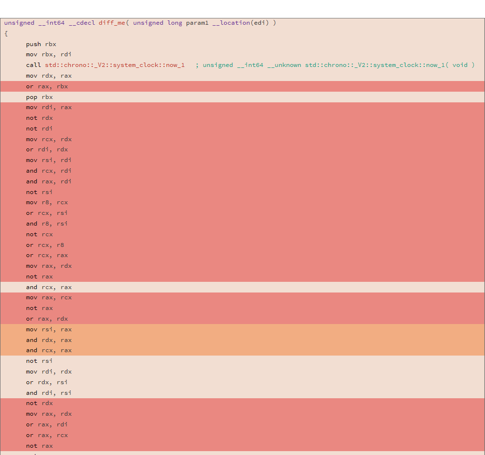
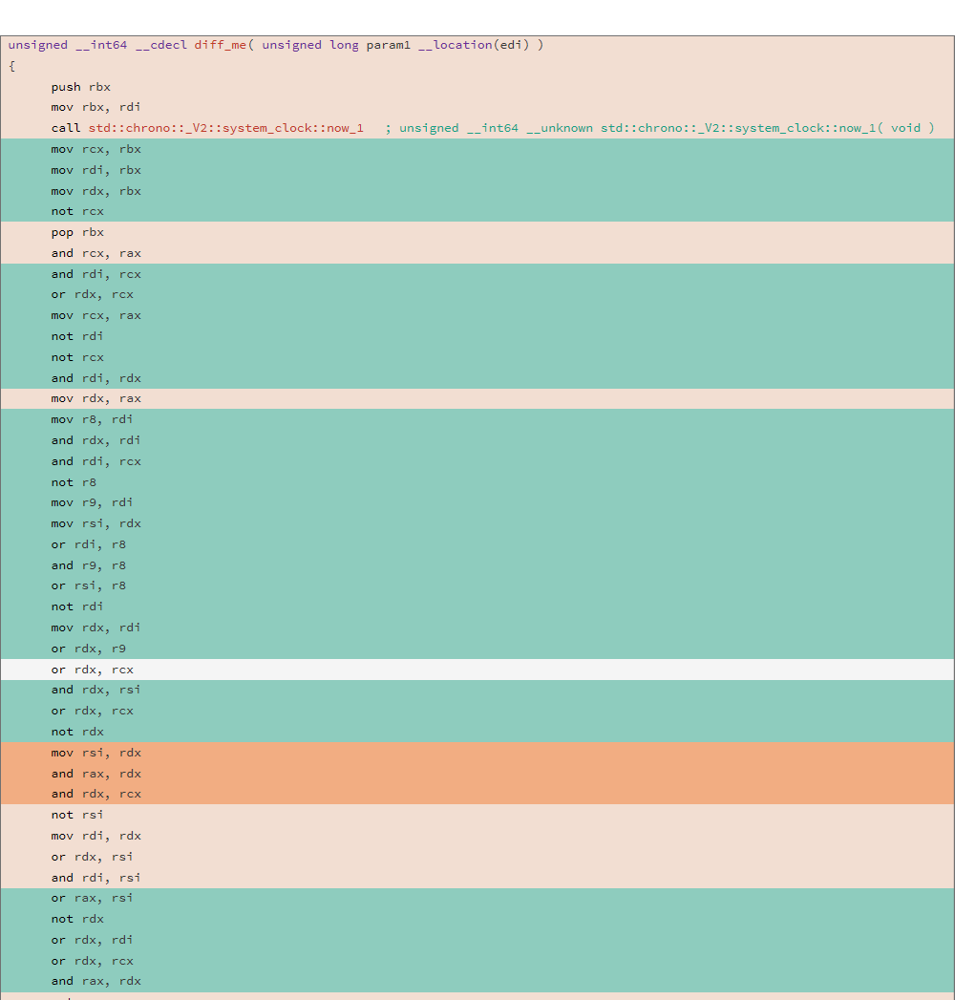

# Prerequisites
- ~~MSVC 2019+~~ It's better to use [clang-cl](http://llvm.org/builds/) because of [this bug](https://developercommunity.visualstudio.com/content/problem/873112/extremely-long-compilation-time-when-using-compile.html)
- Clang 7.0+
- GCC 8.3+
- Gtest
- CMake
- Ninja build  (optional)

For Windows:

Use [vcpkg](https://github.com/microsoft/vcpkg/) or [conan](https://github.com/conan-io/conan) package managers to install Gtest library

For Linux (depends on your distro):

Ubuntu
```
sudo apt-get install libgtest-dev
```
Fedora
```
sudo dnf install gtest-devel
```

# Building

Don't forget to specify toolchain file if you use package managers (-DCMAKE_TOOLCHAIN_FILE=...)
```
cmake -G "Ninja" ..
ninja
```

### Diff
For each compilation you will get different assembly code
```c++
uint64_t diff_me(uint64_t x) {
  using u64 = uint64_t;
  CNNInt<u64> r(std::chrono::system_clock::now().time_since_epoch().count());
  CNNInt<u64> test(x);
  test++;
  test--;
  test|=r;
  test^=r;
  test&=r;
  test^=r;
  test = ~test;
  return test.value();
}
```
For example:



```
Difference (relyze.com tool)
81.13%  diff_me  -  diff_me
```
